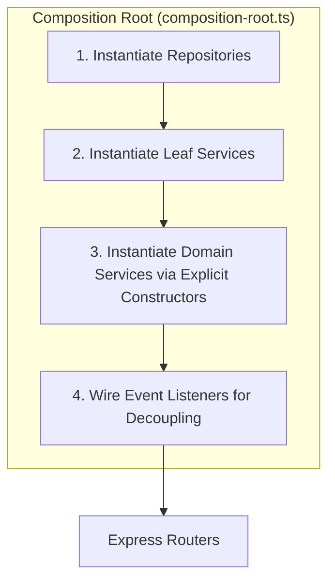

+++
title = "From Service Locator to Composition Root: A Pragmatic Journey to Explicit DI"
description = "How I refactored MatchPicks from a monolithic AppRegistry to an explicit, compiler-checked Composition Root using constructor dependency injection, without heavy frameworks."
date = 2026-02-05T10:00:00+02:00
draft = false
tags = ["Architecture", "Backend", "Node.js", "TypeScript", "Dependency-Injection", "Software-Design"]
categories = ["Software Engineering"]
author = "Jan-Erik Bähr"
toc = true
mermaid = true

[articleSeries]
title = "MatchPicks Article Series"

[[articleSeries.items]]
title = "Part 1: Matchpicks: Sports Picking Platform"
url = "/post/matchpicks-platform-overview/"
description = "project overview and product context"

[[articleSeries.items]]
title = "Part 2: From Service Locator to Composition Root"
url = "/post/from-service-locator-to-composition-root/"
description = "backend architecture and dependency injection refactor"
+++

After working for a while on the Node.js/Express backend for **MatchPicks**, I ran into a classic architectural challenge: as the application expanded to over 30 services and repositories, how could I wire them together without creating a tangled web of imports, hiding dependencies, or getting stuck in circular dependency loops?

From earlier experience I knew a Unity/Zenject codebase for dependency injection (DI). While Zenject is powerful, it eventually felt like a massive, hard-to-trace "black box" where it was difficult to see how dependencies were resolved at runtime. When deciding how to approach this for the Node.js and TypeScript stack, I wanted to avoid bringing in heavy DI container libraries that add complexity and overhead. I also wanted to focus on building the app first without adding a new heavy framework like NestJS to my learning curve. Once I have built this system a few times manually and have more experience with the architectural patterns, I might consider adopting them, but for now, less is more.

This post outlines the move from a quick-and-dirty singleton locator to a cleaner startup structure, and finally to explicit constructor injection in one central place.

Here is how the architecture evolved, the trade-offs involved at each step, and why making dependencies explicit improved the safety of the server.

---

### 1. The Starting Point: The Monolithic `AppRegistry`

In the early prototyping phase of MatchPicks, speed was the only metric that mattered. To get endpoints running and tables queried, I built a single, unified class called `AppRegistry`.

This class acted as a combined **Service Locator and Facade**. It implemented every database repository interface under the sun (`IUserStorage`, `ILeagueRepository`, `IPickRepository`, etc.), instantiated all services inside its constructor, and was passed as a monolithic "context object" to routes and services alike.

It looked roughly like this:

```typescript
// Legacy: The monolithic locator
export class AppRegistry implements IAppRegistry {
  constructor() {
    this.users = new UserRepository();
    this.matches = new MatchRepository();
    // Every service accepted the entire registry!
    this.standingsSvc = new StandingService(this);
    this.picksSvc = new PickService(this);
  }
}
```

#### Why it worked initially:

* Zero startup crashes: because service lookups were resolved lazily at runtime (for example calling `this.registry.users` inside a method), the Node.js interpreter never crashed on startup due to circular imports.
* Rapid prototyping: it was incredibly simple to write. Need a new repository inside a service? Just call `this.registry.methodName()`.

#### The Architectural Smell:

While fast, the Service Locator is a well-known architectural anti-pattern. Because every service accepted the entire `IAppRegistry`, the classes were hiding their actual dependency contracts. Looking at the constructor of `StandingService`, you could not tell what it actually needed to function. It claimed to depend on everything. Even worse, it allowed services to couple tightly in circular loops without warning, hiding structural flaws until they broke at runtime.

---

### 2. The Architectural Goal: Honest Constructors and Fail-Fast Boots

I always knew that a resilient architecture should not make it easy to write spaghetti code, but in the beginning, I consciously chose speed over strict structure. As the codebase matured, it was time to make the system actively resist poor design.

If `UserService` and `LeagueService` depend directly on each other, that is a design smell indicating tight coupling. I wanted the compiler or boot sequence to **fail immediately on startup** if a circular loop was introduced, acting as an architectural alarm system.

To achieve this, I moved the backend toward constructor injection and put the wiring in a single startup file, often called a composition root.



A **Composition Root** is just one place at application startup where I create repositories and services in the right order, then pass them into each other explicitly.

---

### 3. The Tactical Bridge: Dynamic Merging

Migrating a 30-service application all at once can get overwhelming pretty fast. If I had switched every service constructor to explicit dependencies in one step, I would have had to rewrite a lot of internal code at once. That is a good way to introduce regressions.

To bridge this refactor safely, I used a temporary stepping-stone: I limited each service to the dependencies it actually needed and merged those dependencies at startup.

For my heavy services, I defined localized TypeScript interface unions representing only the specific repositories that service was allowed to access:

```typescript
// Localized contract: limit access to only these 5 dependencies
type StandingRegistry = IStandingRepository & IPickRepository & ILeagueRepository & ISeasonRepository & IMatchRepository;
```

Inside the service constructor, I accepted this scoped interface. In the `composition-root.ts`, I used a temporary dynamic merging helper (`mergeInstances`) to combine only those 5 specific repository instances at startup.

Because the constructor parameter was still named `registry` internally, none of the service's internal code had to change right away. That let me keep the app compiling while I untangled the circular dependencies one piece at a time.

---

### 4. The Final Form: Pure, Exploded Constructor DI

Once the infrastructure was stable and the dependency graph was decoupled, I finished the refactor by unraveling the constructors and removing the dynamic merge workaround. Every service now asks for exactly the dependencies it uses.

For example, our `StandingService` now has an honest, explicit constructor:

```typescript
// server/services/core/standing-service.ts
export class StandingService implements IStandingService {
    constructor(
        private standingRepo: IStandingRepository,
        private pickRepo: IPickRepository,
        private leagueRepo: ILeagueRepository,
        private seasonRepo: ISeasonRepository,
        private matchRepo: IMatchRepository,
        private achievementSvc: AchievementService
    ) {}

    async updateStandingsForUser(userId: number, targetLeagueId?: number): Promise<void> {
        // Honest dependency: explicit repository calls!
        const userPicks = await this.pickRepo.getUserPicks(userId);
        // ...
    }
}
```

In `server/composition-root.ts`, all services are now created in a clear order:

```typescript
// server/composition-root.ts
export function composeApplication(): AppContext {
  // 1. Repositories
  const users = new UserRepository();
  const matches = new MatchRepository();
  const teams = new TeamRepository();
  const leagues = new LeagueRepository();
  const standings = new StandingRepository();
  const picks = new PickRepository();
  const seasons = new SeasonRepository();

  // 2. Leaf Services
  const logService = new LogService(logRepo);
  const achievementsSvc = new AchievementService(users, picks);
  const playoffSvc = new PlayoffService(matches, teams);

  // 3. Explicit Constructor Injection (No locators, no merge hacks!)
  const standingsSvc = new StandingService(
    standings,
    picks,
    leagues,
    seasons,
    matches,
    achievementsSvc
  );

  // 4. Wiring Domain Event Listeners (Decoupling services)
  eventBus.on(DomainEvent.MATCH_RESOLVED, (payload) => {
    standingsSvc.handleMatchResolved(payload).catch((err) => {
      console.error("[CompositionRoot] Error in handleMatchResolved listener:", err);
    });
  });

  return { sessionStore, db, services: { standingsSvc, ... }, repos: { ... } };
}
```

---

### 5. Decoupling Cycles with an Event Bus

Moving away from the Service Locator immediately exposed the problem I wanted to catch: several services could not be created because they depended on each other in a loop.

For instance, `MatchService` needed to resolve a match and trigger standing recalculations in `StandingService`. However, `StandingService` needed to query match statuses from `MatchRepository` and `MatchService` to verify outcomes.

To resolve this without tight coupling, we introduced an asynchronous **Event Bus**. Instead of injecting `StandingService` directly into the match resolution layer, the match layer simply emits a `DomainEvent.MATCH_RESOLVED` event.

The `composition-root.ts` acts as the event coordinator, subscribing the appropriate service methods to these events:

```typescript
// Wire events cleanly in the Composition Root
eventBus.on(DomainEvent.MATCH_RESOLVED, (payload) => {
  standingsSvc.handleMatchResolved(payload).catch((err) => {
    console.error("[CompositionRoot] Error in standingsSvc handleMatchResolved listener:", err);
  });
});
```

This pattern broke the cycle without forcing the services to know about each other directly. The match layer now emits an event, and the standings layer reacts to it later.

---

### Conclusion

The main result was practical: circular dependencies stopped being hidden inside one monolithic registry, and the dependency graph became visible at startup. That made problems easier to spot, easier to debug, and safer to change.

This was still a personal project, so the goal was not to ship a framework-heavy architecture for its own sake. The goal was to make the system easier to reason about and keep refactors safe.
