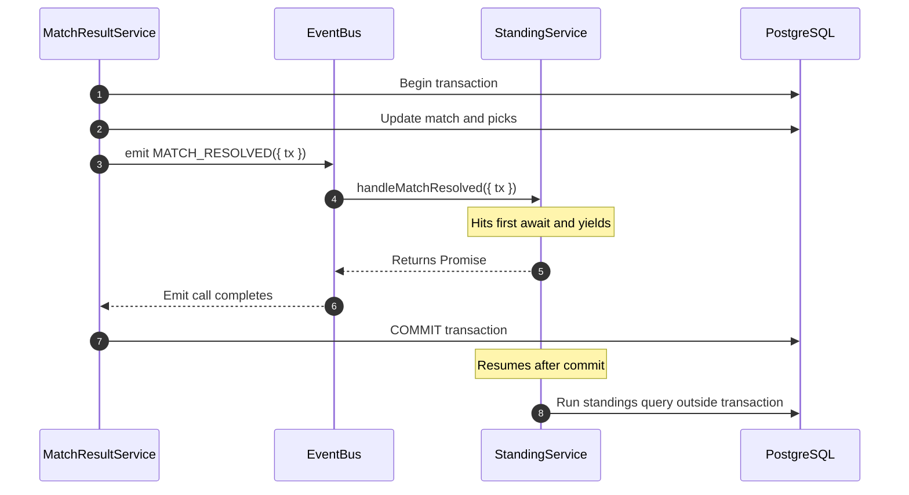

+++
title = "Post-Commit Events: An In-Memory Outbox for a Synchronous Event Bus"
description = "Async event handlers and a synchronous event bus don't belong inside the same database transaction; I fixed it by deferring domain events until after commit with a small in-memory outbox."
date = 2026-02-16T10:00:00+02:00
draft = false
author = "Jan-Erik"
toc = true
mermaid = true

[articleSeries]
series = "matchpicks"
+++

In my [last post](https://www.itsnothing.de/post/from-service-locator-to-composition-root/), I described how I cleaned up the Matchpicks backend by moving to explicit dependency injection and a composition root. As part of that refactor, I also introduced a local event bus so services could react to changes without depending on each other directly.

That sounded clean. It also hid a subtle bug.

When a match gets resolved, the match service emits a `MATCH_RESOLVED` event and the standings service listens to it:

```typescript
// Wiring events in the Composition Root
eventBus.on(DomainEvent.MATCH_RESOLVED, standingService.handleMatchResolved);
```

The code had good test coverage and passed everything I had at the time. But once I turned on stricter TypeScript linting, one warning stood out:

> `Promise-returning function passed to callback expecting void. (@typescript-eslint/no-misused-promises)`

That warning was the clue. The event bus was synchronous, but the handler was `async`.

## What Was Actually Happening

Node's native `EventEmitter` does not wait for promises. It calls listeners synchronously and moves on as soon as the listener yields at its first `await`.

In my case, the match ingestion code looked roughly like this:

```typescript
await db.transaction(async (tx) => {
  await this.matchRepo.updateMatch(dbMatch.id, { status, ... }, tx);
  await this.finalizeMatchPicks(dbMatch.id, winnerId, tx);

  eventBus.emitDomainEvent(DomainEvent.MATCH_RESOLVED, {
    matchId,
    winnerId,
    tx,
  });
});
```

The intention was simple: if anything downstream failed, the whole transaction should roll back.

What actually happened was this:

1. `MatchResultService` starts a database transaction.
2. It emits `MATCH_RESOLVED` synchronously.
3. The listener starts running, then hits its first `await`.
4. The event bus does not wait for the returned promise.
5. The transaction callback finishes.
6. Drizzle commits the transaction and releases the connection.
7. The listener resumes afterwards, now outside the transaction boundary.



## Why This Was Hard to See

The queries still succeeded.

That is what made this nasty. The database connection had been returned to the pool, but the driver could still reuse the socket, so the handler could keep querying. The problem was not a crash. The problem was that the work no longer belonged to the transaction that started it.

If you come from C#, the failure mode is close to an `async void` event handler: the publisher keeps moving, the handler resumes later, and the original transactional context is already gone.

## The Proof

To make the behavior obvious, I built a tiny simulation without any framework code:

```typescript
import { EventEmitter } from "events";

class MockDbClient {
  async transaction(callback: (tx: { isReleased: boolean }) => Promise<void>) {
    console.log("[DB] >>> BEGIN TRANSACTION");
    const tx = { isReleased: false };
    try {
      await callback(tx);
      console.log("[DB] >>> COMMIT TRANSACTION");
    } finally {
      tx.isReleased = true;
      console.log("[DB] >>> Connection client released to pool.");
    }
  }

  async query(sql: string, tx?: { isReleased: boolean }) {
    if (tx?.isReleased) {
      throw new Error("Connection client already released back to the pool!");
    }
    console.log(`[DB] Executing: ${sql}`);
  }
}

const eventBus = new EventEmitter();
```

And the listener:

```typescript
class StandingService {
  constructor(private db: MockDbClient) {}

  async handleMatchResolved(payload: { matchId: number; tx: { isReleased: boolean } }) {
    console.log(`[Listener] Received event for match #${payload.matchId}`);
    await new Promise((resolve) => setTimeout(resolve, 50));
    console.log("[Listener] Resuming standings update...");
    await this.db.query("UPDATE standings SET wins = wins + 1", payload.tx);
  }
}
```

When I ran it, the transaction committed before the listener resumed.

That was the important part: this was not a timing accident. It was structurally guaranteed as soon as an `async` listener was attached to a synchronous emitter.

## The Pragmatic Fix

The classic solution to this kind of problem is the transactional outbox pattern. In a larger distributed setup, that usually means writing events to a table inside the transaction and dispatching them through a separate worker or message broker later.

For Matchpicks, that would have been too much infrastructure.

So I used a small in-memory variant instead:

```typescript
const outboxEvents: MatchResolvedEvent[] = [];

await db.transaction(async (tx) => {
  await this.matchRepo.updateMatch(dbMatch.id, { status, ... }, tx);
  await this.finalizeMatchPicks(dbMatch.id, winnerId, tx);

  outboxEvents.push({
    matchId: dbMatch.id,
    winnerId,
    season: dbMatch.season,
    sportsLeagueId: dbMatch.sports_league_id,
    leagueName: dbMatch.league_name,
    week: dbMatch.week,
  });
});

for (const event of outboxEvents) {
  eventBus.emitDomainEvent(DomainEvent.MATCH_RESOLVED, event);
}
```

In production, that array is declared at the start of the batch methods that ingest scraper results (`MatchResultService.updateWeekResults` and `updateMatches`), so each import run gets its own outbox—not a module-level list shared across requests.

The important change is that the event payload no longer carries a live transaction object. Downstream handlers fetch a fresh connection and do their work on a clean boundary.

## What This Gives Me

* Transactional writes stay inside the transaction.
* Event handlers run only after the database commit succeeds.
* The match service stays decoupled from standings, playoff, and scoring logic.
* The fix stays small enough to understand without adding brokers, workers, or extra tables.

There is one trade-off: this is not the canonical durable outbox. If the process crashes between commit and flush, pending events can be lost. For this project, that was acceptable because the batch size is small and the system already has a recovery path through the admin tooling.

## Conclusion

The linter warning was the right kind of noise. It surfaced a structural bug before it could turn into silent data corruption.

The result is a simpler and safer flow: the database transaction finishes first, then the event bus reacts. That keeps the core write path reliable without dragging the project into a heavier architecture than it needs.
