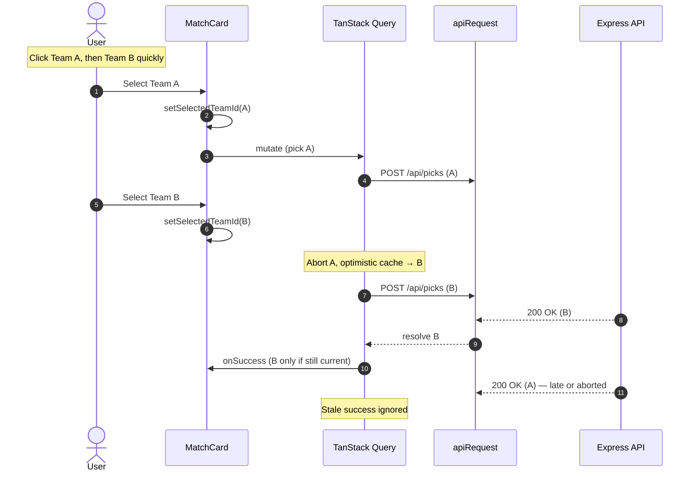

+++
title = "State vs. Network: Resilient Optimistic UI Under Eventual Consistency"
description = "How Matchpicks keeps picks feeling instant while the backend commits asynchronously—and how React Query cancellation, snapshots, and cache invalidation keep client state aligned with PostgreSQL."
date = 2026-03-05T10:00:00+02:00
draft = false
author = "Jan-Erik"
toc = true
mermaid = true

[articleSeries]
series = "matchpicks"
+++

In my [last post](/post/post-commit-events-in-memory-outbox/), I fixed a backend transaction leak: async event listeners were resuming after Drizzle had already committed and released the connection. The fix was a lightweight, in-memory **transactional outbox** that defers `MATCH_RESOLVED` until after commit, so standings work runs on a clean boundary.

That backend change solved one coordination problem. It also sharpened a frontend one: **the UI has to feel instant while writes and downstream recalculations still happen asynchronously**—and rapid clicks must not let slower network responses overwrite newer intent.

## The UX dilemma: spinners vs. instant feedback

When someone submits a pick for the expected winner of a match, they expect immediate visual feedback.

If the interface waits for a full round trip on every click, the app feels sluggish. Optimistic updates—showing the chosen team right away and reconciling with the server in the background—are what make the picks flow feel like a native app.

Reliable optimism still has to handle real failures: timeouts, validation errors when a week locks, and the classic race where a user flips from Team A to Team B before the first request finishes.

## What rapid clicks do to the network

Latency is non-deterministic. Several `POST /api/picks` calls can be in flight at once. Without client-side coordination, the last response to arrive wins—not necessarily the last click:



## Implementation: `useResilientPickMutation`

Picks go through `useResilientPickMutation` in `client/src/hooks/use-resilient-pick-mutation.ts`. `MatchCard` still sets `selectedTeamId` immediately for snappy visuals and local consensus tweaks, but the **canonical pick list** lives in the React Query cache.

Important detail: `cancelQueries` stops in-flight **refetches** for a query key; it does not cancel an older mutation HTTP call by itself. The hook keeps a per-`match_id` `AbortController`, aborts the previous request in `onMutate`, and passes that signal into `apiRequest` (which already supports `AbortSignal` in `query-client.ts`).

```typescript
// Simplified from use-resilient-pick-mutation.ts
onMutate: async (variables) => {
  abortByMatchRef.current.get(variables.match_id)?.abort();
  const abortController = new AbortController();
  abortByMatchRef.current.set(variables.match_id, abortController);

  await queryClient.cancelQueries({ queryKey: queryKeys.picks.user(userId) });
  const previousPicks = queryClient.getQueryData<Pick[]>(queryKey);

  queryClient.setQueryData(queryKey, (old) =>
    mergePickIntoList(old, variables.match_id, variables.picked_team_id, null, variables)
  );

  return { previousPicks, queryKey, abortController };
},

onSuccess: (serverPick, variables, context) => {
  if (abortByMatchRef.current.get(variables.match_id) !== context?.abortController) {
    return; // stale response
  }
  queryClient.setQueryData(context.queryKey, (old) =>
    mergePickIntoList(old, variables.match_id, variables.picked_team_id, serverPick)
  );
},
```

`mergePickIntoList` in `client/src/lib/pick-cache-utils.ts` handles optimistic rows (temporary negative ids) and merges the server `Pick` when it returns.

### How the pieces fit together

1. **`cancelQueries`** — Prevents a background refetch from overwriting the optimistic cache mid-mutation.
2. **Snapshot in `onMutate`** — Restores `previousPicks` in `onError` if the server rejects the write.
3. **Per-match abort** — A newer click on the same match aborts the in-flight `POST`; `isPickMutationAbortError` suppresses error toasts for cancellations.
4. **`onSettled`** — Invalidates picks, user standings, league standings, dashboard matches, consensus, and achievement notifications so the client re-syncs with PostgreSQL.

`useSubmitPick` remains as a thin deprecated alias for callers that still import the old name.

Vitest covers the race (team B wins when A resolves late), server error rollback, and no toast on abort (`use-resilient-pick-mutation.test.tsx`).

## Bridging picks to standings (eventual consistency)

The pick lifecycle does not end at `POST /api/picks`. A match is played, results are ingested, `MATCH_RESOLVED` fires **after commit** (Part 3), and standings are recalculated in a separate async step. There is a window where the database has a final score but the standings query on the client is still stale.

Two mechanisms close that gap:

**Invalidation on pick save** — `onSettled` still invalidates standings and related keys after every pick mutation.

**WebSocket push after recalculation** — `RealtimeBroadcastService` on the server broadcasts `{ type: "STANDINGS_RECALCULATED", leagueId, season }` on `/ws` after `StandingService` recalculates ranks for a picking league. The client hook `useStandingsSync` (in `picks-page`, league `PicksView`, and `StandingsView`) invalidates `queryKeys.leagues.standings` when the message matches the active league. It reconnects with exponential backoff; the URL comes from `VITE_WS_URL` or the same host at `/ws?leagueId=…`.

`my-picks-page` is picks-only and does not mount standings sync—that is intentional.

Broadcast currently fires after regular-season rank recalc for each league; playoff and achievement work in the same handler may still be running. That is acceptable for demo scale but worth tightening if playoff standings need to be strictly atomic on the client.

## Designing for real-world failures

- **Locked week / validation errors** — Cache rollback via the hook; `MatchCard` resets `selectedTeamId` from `userPick` on `mutate` `onError`.
- **Timeouts** — `apiRequest` enforces a client-side timeout via `AbortController`.
- **Worst case** — Navigation or refetch-on-focus still rebuilds state from the API.

Offline queuing (`persistQueryClient` + IndexedDB) remains on the backlog.

## Conclusion

Parts 3 and 4 are the same class of problem seen from different layers: **non-deterministic ordering in asynchronous systems.**

On the backend, an `async` listener on a synchronous event bus let work escape the transaction boundary. On the frontend, concurrent HTTP responses could overwrite newer intent until per-match abort, optimistic cache snapshots, and stale `onSuccess` guards were in place.

The through-line is defensive boundaries: post-commit outbox on the server, cancellation plus snapshots on the client, and a small WebSocket hint when standings finish recalculating.
